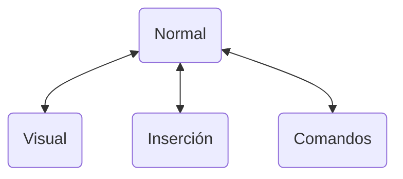
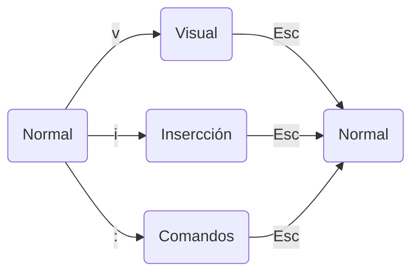

# Introducción

Vim es conocido por su eficiencia y su enfoque en la edición de texto rápida y sin esfuerzo; y aunque puede tener una curva de aprendizaje empinada al principio, dominar Vim te recompensará con **una experiencia de edición fluida y altamente personalizable**.

## Modos de Vim: *un nuevo paradigma*

Vim opera en 4 modos principales: **Normal**, **Inserción**, **Visual** y **Comando**.

- El **modo normal** te permite moverte rápidamente, copiar y eliminar texto.
- El **modo de inserción** te permite escribir y editar texto como en cualquier otro editor.
- El **modo visual** te permite seleccionar partes del texto para realizar operaciones sobre ellas.
- El **modo de comandos** te permite ejecutar comandos de Vim.

> **Note**  
> Vim siempre comienza en el **modo normal**.

## Acciones

Durante esta sección verás algunas de las acciones más habituales de Vim.  
Sin embargo, antes de empezar, debes saber el formato que van a seguir.

**Las *pulsaciones de teclas* se representan con la siguiente sintaxis: <kbd>Teclado</kbd>.**

Vim funciona puramente con texto, por lo que las teclas juegan un papel muy importante.  
Cuando veas una <kbd>tecla</kbd> o combinación de ellas, debes asumir que debes pulsarlas en tu teclado.  
Al mismo tiempo, habrá combinaciones lógicas que debes entender como un solo comando.

Ejemplos:

- <kbd>Esc</kbd> : la tecla $\text{Esc}$ existe, tiene nombre propio (empieza por mayúscula).
- <kbd>abc</kbd> : la tecla $\text{abc}$ no existe, querrá decir pulsar <kbd>a</kbd>, <kbd>b</kbd> y <kbd>c</kbd> en ese orden.
- <kbd>Ctrl + c</kbd> : la tecla $\text{Ctrl + c}$ no existe, querrá decir pulsar <kbd>Ctrl</kbd> y <kbd>c</kbd> al mismo tiempo.
- <kbd>I</kbd> : la tecla existe, es la letra $\text{i}$ mayúscula, equivalente a <kbd>Shift + i</kbd>.

**Los *comandos* se representan con la siguiente sintaxis: `:comando(s)`.**

Vim permite ejecutar comandos desde el **modo normal**, extendiendo sus funcionalidades.

Cuando veas un `:comando`, se indicarán sus argumentos si los tuviera; en caso contrario, el comando se ejecutará tal cual.

### Cambiar de modo

Puedes cambiar de modo fácilmente pulsando las teclas correspondientes:

|             Teclas             | Acción                                                                      |
|:------------------------------:|:--------------------------------------------------------------------------- |
|         <kbd>Esc</kbd>         | Cambiar al **modo normal** desde cualquier otro modo                        |
|          <kbd>i</kbd>          | Cambiar al **modo de inserción** desde el **modo normal**                   |
|          <kbd>v</kbd>          | Cambiar al **modo visual** desde el **modo normal**                         |
|          <kbd>:</kbd>          | Cambiar al **modo de comandos** desde el **modo normal**                    |
|      <kbd>Ctrl + c</kbd>       | Cambiar al **modo normal** desde el **modo visual** o **modo de inserción** |

### Modo normal

El **modo normal** te permite navegar por el fichero con una combinación de teclas intuitiva.

#### Navegación eficiente: *el arte de moverse*

|    Teclas     | Acción                                         |
|:-------------:|:---------------------------------------------- |
| <kbd>h</kbd>  | Desplazar el cursor a la **izquierda**         |
| <kbd>j</kbd>  | Desplazar el cursor hacia **abajo**            |
| <kbd>k</kbd>  | Desplazar el cursor hacia **arriba**           |
| <kbd>l</kbd>  | Desplazar el cursor a la **derecha**           |
| <kbd>w</kbd>  | Desplazar el cursor a la **siguiente palabra** |
| <kbd>b</kbd>  | Desplazar el cursor a la **palabra anterior**  |
| <kbd>0</kbd>  | Desplazar el cursor al **inicio de la línea**  |
| <kbd>$</kbd>  | Desplazar el cursor al **final de la línea**   |
| <kbd>gg</kbd> | Desplazar el cursor al **inicio del fichero**  |
| <kbd>G</kbd>  | Desplazar el cursor al **final del fichero**   |

> **Note**  
> Puedes usar $n$ antes de un comando para repetir su acción $n$ veces.
>
> Ejemplos:
> - <kbd>2w</kbd> : desplazar el cursor a la 2ª palabra siguiente.
> - <kbd>7j</kbd> : desplazar el cursor hacia abajo 7 veces.

#### Edición con estilo: *de cero a héroe*

|    Teclas     | Acción                                                                                           |
|:-------------:|:------------------------------------------------------------------------------------------------ |
| <kbd>a</kbd>  | Insertar texto **después del cursor**                                                            |
| <kbd>A</kbd>  | Insertar texto **al final de la línea**                                                          |
| <kbd>i</kbd>  | Insertar texto **antes del cursor**                                                              |
| <kbd>I</kbd>  | Insertar texto **al inicio de la línea**                                                         |
| <kbd>o</kbd>  | Insertar una **nueva línea debajo de la línea actual** *Esta acción cambia al modo inserción* |
| <kbd>O</kbd>  | Insertar una **nueva línea encima de la línea actual** *Esta acción cambia al modo inserción* |
| <kbd>dd</kbd> | Eliminar la línea actual                                                                         |
| <kbd>yy</kbd> | Copiar la línea actual                                                                           |
| <kbd>p</kbd>  | Pegar texto **después del cursor**                                                               |
| <kbd>P</kbd>  | Pegar texto **antes del cursor**                                                                 |

> **Note**  
> Puedes usar $n$ antes de un comando para repetir su acción $n$ veces.
> 
> Ejemplos:
> - <kbd>3a</kbd> : insertar texto después del cursor 3 veces.
> - <kbd>5dd</kbd> : eliminar 5 líneas (la línea actual y las 4 siguientes).

> **Warning**  
> El texto copiado con <kbd>p</kbd> o <kbd>P</kbd> se almacena en el portapapeles de Vim, no en el del sistema.
> 
> Esto quiere decir que si copias texto en Vim, no podrás pegarlo fuera de Vim.

### Modo visual

El **modo visual** es la herramienta para seleccionar texto. 

#### Poder visual: *seleccionar para impactar*

|    Teclas    | Acción                 |
|:------------:|:---------------------- |
| <kbd>v</kbd> | Seleccionar caracteres |
| <kbd>V</kbd> | Seleccionar líneas     |

Una vez seleccionado, puedes copiar, eliminar y más.

|    Teclas    | Acción                                                     |
|:------------:|:---------------------------------------------------------- |
| <kbd>y</kbd> | **Copiar** el texto seleccionado                           |
| <kbd>d</kbd> | **Eliminar** el texto seleccionado                         |
| <kbd>c</kbd> | **Sustituir** el texto seleccionado por el texto insertado |
| <kbd>></kbd> | **Indentar** el texto seleccionado                         |
| <kbd><</kbd> | **Desindentar** el texto seleccionado                      |

#### Control de cambios: *rehacer y deshacer*

|       Teclas        | Acción                    |
|:-------------------:|:------------------------- |
|    <kbd>u</kbd>     | Deshacer la última acción |
| <kbd>Ctrl + r</kbd> | Rehacer la última acción  |

#### Buscar y transformar: *dominando la edición*

|         Teclas          | Acción                                                                         |
|:-----------------------:|:------------------------------------------------------------------------------ |
| <kbd>/</kbd> + *texto*  | Buscar *texto* del cursor hacia adelante                                       |
| <kbd>?</kbd> + *texto*  | Buscar *texto* del cursor hacia atrás                                          |
|  `:s/texto/sustituto/`  | Reemplazar `texto` por `sustituto` en la línea actual                          |
| `:s/texto/sustituto/g`  | Reemplazar todas las ocurrencias de `texto` por `sustituto` en la línea actual |
| `:%s/texto/sustituto/g` | Reemplazar todas las ocurrencias de `texto` por `sustituto` en todo el fichero |

> **Note**  
> Puedes usar <kbd>n</kbd> para buscar la siguiente ocurrencia de `texto` y <kbd>N</kbd> para buscar la anterior.
>
> Ejemplos:
> - <kbd>/</kbd> + `texto` + <kbd>Enter</kbd> + <kbd>n</kbd> : buscar `texto` hacia adelante.

### Modo inserción

El **modo inserción** es el modo en el que puedes escribir texto en Vim.

Usarás las teclas, principalmente, para escribir texto.

### Modo comando

El **modo comando** es el modo en el que puedes ejecutar comandos de Vim.

#### Guardar y salir: *el arte de la persistencia*

|                Teclas                 | Acción                                  |
|:-------------------------------------:|:--------------------------------------- |
|                 `:w`                  | Guardar el fichero                      |
|                 `:q`                  | Salir de Vim (si no hay cambios)        |
|         `:q!` / <kbd>ZQ</kbd>         | Salir de Vim forzosamente (sin guardar) |
| `:wq` / `:exi` / `:x` / <kbd>ZZ</kbd> | Guardar y salir de Vim                  |
|                `:wq!`                 | Guardar y salir de Vim forzosamente     |

### ¡Ayuda!

Por último, pero no menos importante, **Vim tiene una ayuda integrada: el comando `:help`**.

Este comando te permitirá buscar y leer la documentación de Vim.

## Conclusión

Vim es una herramienta poderosa y versátil, y aunque puede requerir tiempo para acostumbrarse, su eficiencia y capacidad de personalización lo hacen una herramienta valiosa para programadores, escritores y cualquier persona que trabaje con texto.

A medida que explores y practiques, descubrirás cómo Vim puede mejorar significativamente tu flujo de trabajo de edición.

Y por supuesto, **existen conceptos más allá de esta guía** (como los *plugins*) que no se han tratado aquí; te invito a que los descubras una vez hayas dominado estas combinaciones de teclas y comandos.

